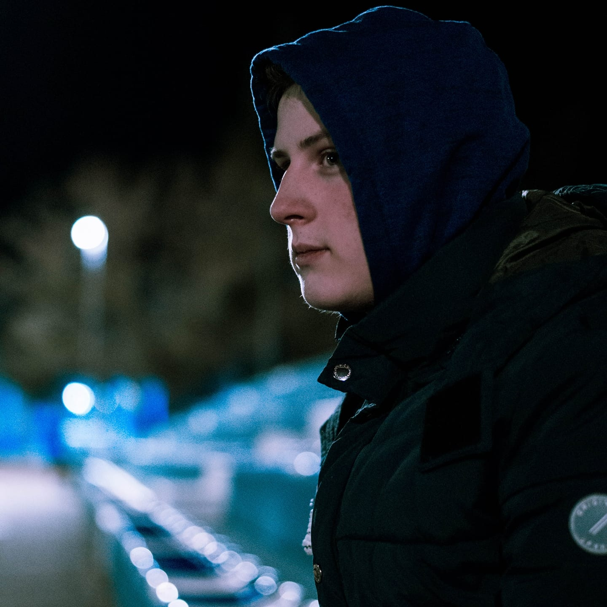

# Životopis
# Fotografija

## 1. Osobni podaci
* Antonio
* Zubčić
* Studiram informacijske tehnologije i bavim se foto i video produkcijom
* 25.05.2001.
* Muškarac
* Hrvatsko državljanstvo
## 2. Kontakt
* antoniozubcic@icloud.com
* 095 567 8088
* __Društvene mreže:__
    * Facebook: Antonio Zubcoc
    * Instagram: @ja_sam_z
    * Twitter: @AntonioZubcic
* __Trenutna razmjena poruka:__
    * WhatsApp: Z
    * Instagram: @ja_sam_z
    * Viber: Antonio Zubcic
    * Telegram: Antonio Z
    * Messenger: Antonio Zubcic
    * Instagram link: https://www.instagram.com/ja_sam_z
## 3. Adresa
* Put bokanjca
* 2
* 23000
* Zadar
* Hrvatska
## 4. Radno iskustvo
### Službeni fotograf
* Opera Klub Zadar i Freelance
* Zadar
* Hrvatska
* Ljeto 2020.
* Stvaranje fotogalerija izlazaka, fotografiranje i uređivanje slika te na taj način ostavljanje dobrih dojmova gostima kluba
### Social Media & PR Manager
* Santorini Lounge Bar & Restaurant
* Kožino, Zadar
* Hrvatska
* Ljeto 2019. i 2020.
* Objavljivanje sadržaja na stranice objekta u svrhu poboljšanja online identiteta objekta (Kreiranje fotogalerija te primamljivih oglasa) 
## 5. Obrazovanje
* _Sveučilište u Zadru - Preddiplomski stručni studij informacijskih tehnologija_
    * Kvalifikacija u tijeku
    * Zadar
    * Hrvatska
    * U tijeku
* _Gimnazija Jurja Barakovića_
    * Opća gimnazija - Završena srednja škola
    * Zadar
    * Hrvatska
    * 2016./2017. - 2019/2020.
 * _Osnovna škola Šimuna Kožičića Benje_
    * Završena osnovna škola
    * Zadar
    * Hrvatska
    * 2008./2009. - 2015./2016.
## 6. Jezične vještine
* Materinski jezik:
    * Hrvatski jezik
* Strani jezik:
    * __Engleski jezik:__
        * Razumijevanje:
            * Slušanje: C1
            * Čitanje: B2
        * Govor:
            * Govorna interakcija: B2
            * Govorna produkcija: C1
        * Pisanje: C1
    * __Njemački jezik:__
        * Razumijevanje:
            * Slušanje: B1
            * Čitanje: A2
        * Govor:
            * Govorna interakcija: B1
            * Govorna produkcija: B1
        * Pisanje: A2
    * __Talijanski jezik:__
        * Razumijevanje:
            * Slušanje: B1
            * Čitanje: A2
        * Govor:
            * Govorna interakcija: A2
            * Govorna produkcija: A2
        * Pisanje: A2
## 7. Digitalne vještine
Uredsko poslovanje | Osnove programskih jezika | Frontend | Sustavi za verzioniranje i suradnički rad
-- | - | - | - |
Word | Python | HTML | Git 
Excel | | | Google Drive
PowerPoint | | | GitHub 
Adobe (Lightroom, Photoshop, Premiere Pro)| | | | Microsoft Teams
## 8. Društvene i političke aktivnosti
* Pripadnik mladih ambasadora EU parlamenta
* Zadar - Zagreb
* 2017.-2020.
## 9. Hobiji i interesi
* Fotografija i video produkcija
    * Bavim se foto i video profukcijom 5 godina uz stalne nadogradnje opreme
* Marketing
    * Bavim se marketingom 2 godine uz stalna napredovanja
* Programiranje
    * Programiranje me zanima otkako sam bio dijete no sa trudom sam počeo tek prije dvije godine u srednjoj školi
## 10. Komunikacijske i međuljudske vještine
* Za sebe smatram da imam iznimno dobre komunikacijske i međuljudske vještine s obzirom da su to jedne od glavnih vještina u mom trenutnom zanimanju
## 11. Konferencije, seminari, stručna usavršavanja
* Mladi Ambasadori
    * Rujan 2018. godine
    * Zagreb
    * Seminar
* Video-summit
    * 11.svibnja 2018. godine
    * Split
    * Video konferencija u organizaciji ureda EU parlamenta 
* OvajPutGlasam.eu
    * travanj 2019.
    * Zagreb
    * Seminar
## 12. Kreativni radovi
* KORISTAN BUDI, GLASAJ I PRESUDI
    * Objavljen 10.9.2018.
    * Zadar
    * Sudjelovanje u projektu EU ambasdoira
* Predizborni spot
    * Objavljen 21.1.2019.
    * Zadar
    * Natječaj EU parlamenta
## 13. Mreže i članstva
* Nemam članstva
## 14. Organizacijske vještine
* "Slatki tjedan"
* Humanitarna organizacija za prikupljanje novca u dobrotvorne svrhe (Udruga Cukrići) organizirana od strane učenika Gimnazije Jurja Barakovića
## 15. Počasti i nagrade
* Djelovanje kao mladi ambasador u 2017./2018. godini
    * Ured za vezu Europskog parlamenta u Hrvatskoj
    * Rujan 2018. godine
* Osvojeno prvo mjesto na natječaju EU parlamenta - predizborni spot
    * Organizacija: Hrvatska zajednica županija i "EU2ME"
    * Siječanj 2019. godine
## 16. Preporuke
* Bez preporuke
## 17. Projekti
* "Slatki tjedan"
* Travanj 2019.
* Humanitarna organizacija
## 18. Publikacije
* KREATIVCI IZ "BARAKOVIĆA" Videom poručili: Koristan budi, glasaj i presudi!
*  31/01/2019
* https://www.zadarskilist.hr/clanci/31012019/kreativci-iz-barakovica-videom-porucili-koristan-budi-glasaj-i-presudi
## 19. Vještine/iskustvo upravljanja i rukovođenja
* Iskustvo rukovođenja i organizacije humanitarnih događaja tijekom 2018. i 2019. godine sa kolegama iz gimnazije
## 20. Volontiranje
* Volontiranje u sklopu programa volontiranja Gimnazije Jurja Barakovića
* Dom za starije i nemoćne osobe Zadar te odjel pedijatrije u bolnici
* Zadar
* Kroz 2018. godina
## 21. Vozačka dozvola
* Ne posjedujem